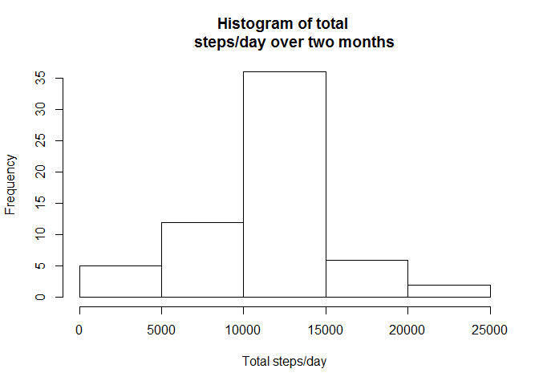

# Reproducible Research: Peer Assessment 1


## Loading and preprocessing the data
###Read csv data and subset to rows with valid steps entries only

```r
data_steps <- read.csv("activity.csv")
data_valid_steps <- data_steps[!is.na(data_steps$steps),]
```


## What is mean total number of steps taken per day?
###Reshape the steps data by taking sum over days

```r
library(ggplot2)
```

```
## Warning: package 'ggplot2' was built under R version 3.3.3
```

```r
library(reshape2)
```

```
## Warning: package 'reshape2' was built under R version 3.3.3
```

```r
melted_steps <- melt(data_valid_steps, id=c("date"), measure.vars="steps")
tidy_steps <-dcast(melted_steps, date ~ variable, sum)
tidy_steps$date <- as.Date(tidy_steps$date, "%Y-%m-%d")
tidy_steps$days<-format(tidy_steps$date, "%b %d")
```
###Compute mean and median from reshaped data

```r
mean_steps_per_day <- as.integer(mean(tidy_steps$steps))
median_steps_per_day <- as.integer(median(tidy_steps$steps))
hist(tidy_steps$steps, xlab = "Total steps/day", main = "Histogram of total 
     steps/day over two months")
```

<!-- -->

- Mean of total steps per day = 10766
- Median of total steps per day = 10765


## What is the average daily activity pattern?


```r
melted_steps2 <- melt(data_valid_steps, id=c("interval"), measure.vars="steps")
tidy_steps2 <-dcast(melted_steps2, interval ~ variable, mean)
max_steps_interval <- 
        tidy_steps2$interval[tidy_steps2$steps == max(tidy_steps2$steps)]
max_steps <- max(tidy_steps2$steps)
plot(tidy_steps2$interval, tidy_steps2$steps, type="l", xlab="Time interval", 
     ylab="Average steps", main = "Average steps over days by time interval")
```

<!-- -->

- Interval with max average steps, averaged across days = 835


## Imputing missing values
###First calculate number of NA's


```r
number_na <- sum(as.integer(is.na(data_steps$steps)))
```
- Number of missing values = 2304

###Code for imputing values based on mean of interval
(Example from stackoverflow on 7/27/2017 https://stackoverflow.com/questions/21712384/updating-column-in-one-dataframe-with-value-from-another-dataframe-based-on-matc)


```r
#Add a column to the original dataset containing the mean corresponding to
# every time interval, by matching the "interval" value
# from the tidy_steps2 DF. Note we have to "match"
# since these two DFs have different lengths
# Note the second argument "2" is because interval is on col 2 of tidy_steps2
data_steps$mean <- tidy_steps2[match(data_steps$interval, 
                                     tidy_steps2$interval), 2]
# Create a new DF for imputed values
data_steps_imput <- data_steps
# Copy over mean to steps if steps is NA, otherwise keep it as steps
data_steps_imput$steps<-ifelse(is.na(data_steps_imput$steps), 
                               data_steps_imput$mean, 
                               data_steps_imput$steps)
# Example from stackoverflow on 7/27/2017 #https://stackoverflow.com/questions/21712384/updating-column-in-one-dataframe-with-value-from-another-dataframe-based-on-matc
#
```

###Histogram of total number of steps

```r
melted_steps <- melt(data_steps_imput, id=c("date"), measure.vars="steps")
tidy_steps <-dcast(melted_steps, date ~ variable, sum)
tidy_steps$date <- as.Date(tidy_steps$date, "%Y-%m-%d")
tidy_steps$days<-format(tidy_steps$date, "%b %d")
mean_steps_per_day <- as.integer(mean(tidy_steps$steps))
median_steps_per_day <- as.integer(median(tidy_steps$steps))
hist(tidy_steps$steps, xlab = "Total steps/day", main = "Histogram of total 
     steps/day over two months")
```

<!-- -->

- Mean of total steps per day (with imputing) = 10766
- Median of total steps per day (with imputing) = 10766

These do not differ significantly from the values obtained by dropping the
NA values in this particular case


## Are there differences in activity patterns between weekdays and weekends?
###Append a column indicating weekday/weekend
Used the example listed here: https://stackoverflow.com/questions/28893193/creating-factor-variables-weekend-and-weekday-from-date


```r
data_steps_imput$date <- as.Date(data_steps_imput$date)
#create a vector of weekdays
weekdays1 <- c('Monday', 'Tuesday', 'Wednesday', 'Thursday', 'Friday')
#Use `%in%` and `weekdays` to create a logical vector
#convert to `factor` and specify the `levels/labels`
data_steps_imput$wDay <- factor((weekdays(data_steps_imput$date) 
                                 %in% weekdays1), 
                                levels=c(FALSE, TRUE), 
                                labels=c('weekend', 'weekday'))
```

###Create a tidy DF for averaging over wDay and interval

```r
melted_steps <- melt(data_steps_imput, id=c("interval", "wDay"), measure.vars="steps")
tidy_steps <-dcast(melted_steps, interval + wDay ~ variable, mean)
```

###Create panel plot in lattice

```r
library(lattice)
xyplot(tidy_steps$steps~tidy_steps$interval|tidy_steps$wDay, type = 'l',
   xlab="Interval", ylab="Number of Steps")
```

<!-- -->
